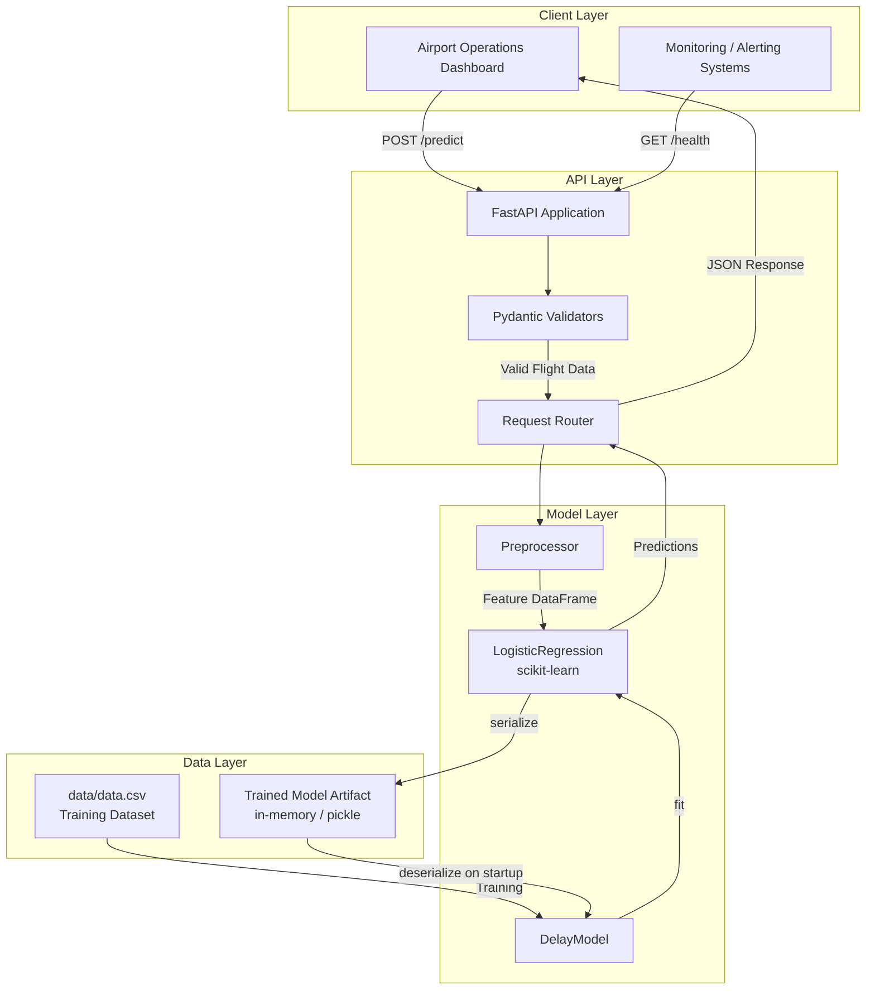
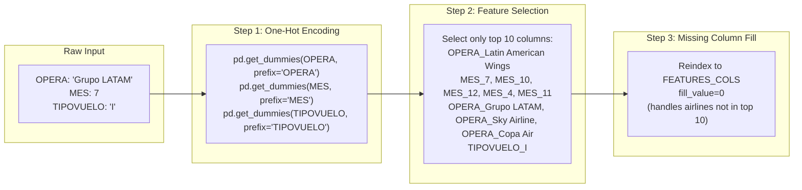
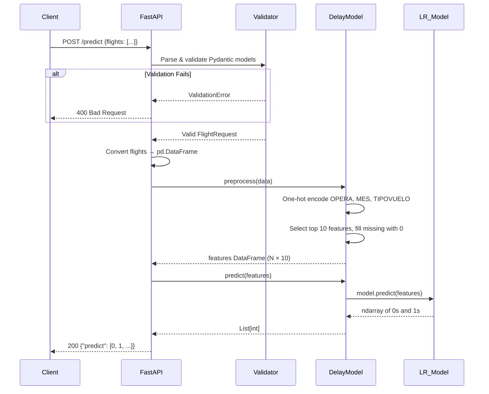
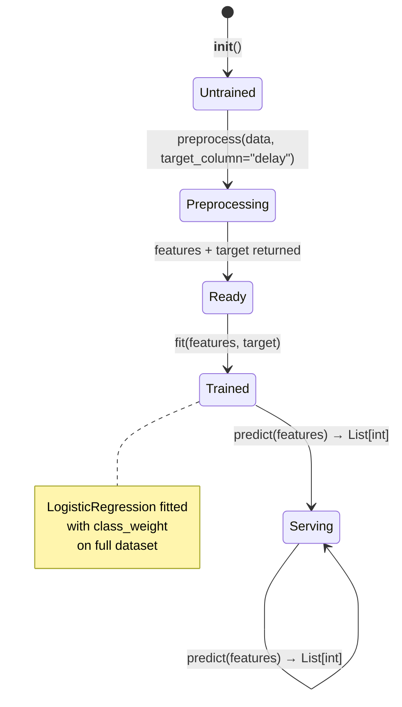
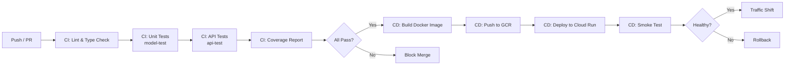

# RFC: Operationalizing the SCL Flight Delay Prediction Service

| Field         | Value                                              |
|---------------|----------------------------------------------------|
| **Author**    | ML Engineering Team                                |
| **Status**    | DRAFT — Pending Review                             |
| **Created**   | 2026-07-04                                         |
| **Component** | `challenge` — Flight Delay Prediction Microservice |
| **Language**  | Python 3.9+                                        |
| **Framework** | FastAPI + scikit-learn                             |

---

## Table of Contents

1. [Context & Scope](#1-context--scope)
2. [Goals & Non-Goals](#2-goals--non-goals)
3. [The Actual Design](#3-the-actual-design)
4. [Alternatives Considered](#4-alternatives-considered)
5. [Cross-Cutting Concerns](#5-cross-cutting-concerns)
6. [Edge Cases Checklist](#6-edge-cases-checklist)
7. [Appendices](#7-appendices)

---

## 1. Context & Scope

### 1.1 Problem Statement

Santiago Arturo Merino Benítez International Airport (SCL) handles ~24 million passengers annually. Flight delays cascade through the network, impacting gate assignments, crew scheduling, passenger connections, and ground operations. The Data Science team has built an exploratory Jupyter notebook that trains six classification models to predict whether a flight will be delayed by more than 15 minutes.

**The notebook is a research artifact. It cannot serve real-time predictions.**

Our task is to transform this notebook into a production-grade, containerized REST microservice that:

- Accepts flight information via HTTP and returns a delay prediction (0 or 1) in real time.
- Passes all existing unit, integration, and stress tests.
- Ships via a reproducible CI/CD pipeline to a cloud environment (GCP).

### 1.2 User Story

> **As an** airport operations dashboard,
> **I want to** send a batch of upcoming flight records to an API endpoint and receive a binary delay prediction for each,
> **so that** I can proactively flag flights likely to be delayed and trigger mitigation workflows (gate reassignment, crew alerts, passenger notifications).

### 1.3 Stakeholders

| Stakeholder          | Interest                                            |
|----------------------|-----------------------------------------------------|
| Airport Operations   | Real-time delay alerts for SCL flights              |
| Data Science Team    | Model fidelity to notebook conclusions              |
| Platform / SRE       | Observability, uptime SLA, rollback capability      |
| Security Team        | Input validation, no PII leakage                    |
| Hiring Committee     | Code quality, engineering rigor, production readiness|

### 1.4 Scope

**IN scope:**

- Implementing `DelayModel.preprocess()`, `DelayModel.fit()`, and `DelayModel.predict()` in `model.py`.
- Implementing the `/predict` POST endpoint in `api.py` with full input validation.
- Fixing the three bugs discovered in the notebook (boundary conditions, inverted rate, type hint syntax).
- Building a multi-stage Dockerfile for production deployment.
- Writing CI/CD GitHub Actions workflows for testing and deployment.
- Ensuring all 8 existing tests pass (4 model + 4 API) without modification.

**OUT of scope:**

- Retraining the model on new data or performing hyperparameter optimization.
- Building a model registry, feature store, or experiment tracking system.
- Creating a frontend dashboard or mobile application.
- Multi-airport support (only SCL flights from the provided dataset).
- Real-time streaming ingestion (batch HTTP only).
- Model retraining pipelines or drift detection.

---

## 2. Goals & Non-Goals

### 2.1 Goals (Measurable Success Criteria)

| #  | Goal                                                                 | Metric / Acceptance Criterion                               |
|----|----------------------------------------------------------------------|-------------------------------------------------------------|
| G1 | All existing tests pass without modification                         | `pytest` exit code 0 on all 8 tests                         |
| G2 | Model recall for class "1" (delays) exceeds 60%                      | `report["1"]["recall"] > 0.60` on 33% validation split      |
| G3 | Model F1 for class "1" (delays) exceeds 0.30                         | `report["1"]["f1-score"] > 0.30` on 33% validation split    |
| G4 | API validates all inputs and rejects invalid data with HTTP 400      | 3 validation test cases pass                                |
| G5 | API serves predictions with p99 latency < 200ms                     | Locust stress test: 100 users, 60s, p99 < 200ms            |
| G6 | Docker image is production-ready                                     | Multi-stage build, non-root user, < 500MB image size        |
| G7 | CI/CD pipeline runs on every PR                                      | GitHub Actions: lint → test → build → deploy                |
| G8 | Code coverage ≥ 80% on `challenge/` package                          | `pytest-cov` reports ≥ 80%                                  |

### 2.2 Non-Goals (Explicit Exclusions)

| #  | Non-Goal                                        | Rationale for Exclusion                                                    |
|----|-------------------------------------------------|----------------------------------------------------------------------------|
| NG1| Hyperparameter tuning (GridSearch, Optuna)      | DS concluded "no noticeable difference" between models; tuning adds complexity without clear ROI at this stage |
| NG2| XGBoost model support                           | Not in `requirements.txt`; would add a C++ dependency, larger image, more attack surface |
| NG3| Online learning / model retraining              | Requires streaming infrastructure, model versioning, A/B testing — separate project |
| NG4| Multi-model ensemble                            | Adds latency, complexity, and debugging difficulty for marginal gain        |
| NG5| Feature engineering beyond the top 10           | DS validated that top 10 features preserve performance; more features = more validation surface |
| NG6| GPU acceleration                                | Logistic Regression on 10 binary features does not benefit from GPU         |
| NG7| A/B testing framework                           | Premature for v1; canary deployments suffice for initial rollout            |

---

## 3. The Actual Design

### 3.1 Architecture Overview



### 3.2 Component Breakdown

#### 3.2.1 `DelayModel` (`challenge/model.py`)

The core ML class with three methods. This is the heart of the system.

```
DelayModel
├── __init__()          → Initialize self._model = None
├── preprocess(data, target_column=None)
│   ├── Training mode (target_column="delay"):
│   │   ├── Compute 'delay' from Fecha-O and Fecha-I
│   │   ├── One-hot encode OPERA, MES, TIPOVUELO
│   │   ├── Select top 10 features
│   │   └── Return (features_df[10 cols], target_df[1 col])
│   └── Serving mode (target_column=None):
│       ├── One-hot encode OPERA, MES, TIPOVUELO
│       ├── Select top 10 features (fill missing with 0)
│       └── Return features_df[10 cols]
├── fit(features, target)
│   ├── Compute class weights from target distribution
│   ├── Instantiate LogisticRegression(class_weight=...)
│   ├── Fit on full dataset
│   └── Store in self._model
└── predict(features)
    ├── Call self._model.predict(features)
    └── Return List[int]
```

#### 3.2.2 `FastAPI Application` (`challenge/api.py`)

```
FastAPI App
├── GET /health
│   └── Return {"status": "OK"}
└── POST /predict
    ├── Parse request body → FlightRequest (Pydantic)
    ├── Validate each flight:
    │   ├── OPERA ∈ known airlines set
    │   ├── TIPOVUELO ∈ {"I", "N"}
    │   └── MES ∈ {1, 2, ..., 12}
    ├── On validation failure → HTTP 400
    ├── Convert to DataFrame
    ├── Call model.preprocess(data)
    ├── Call model.predict(features)
    └── Return {"predict": [0, 1, ...]}
```

#### 3.2.3 `Pydantic Models` (input validation)

```python
class Flight(BaseModel):
    OPERA: str        # Airline name (validated against known set)
    TIPOVUELO: str    # "I" (International) or "N" (National)
    MES: int          # Month 1-12

class FlightRequest(BaseModel):
    flights: List[Flight]
```

### 3.3 Preprocessing Pipeline — Detailed Design

The preprocessing pipeline transforms raw flight records into a 10-column binary feature matrix. This is the most critical component because **any mismatch between training and serving preprocessing causes silent prediction errors** (training-serving skew).



#### Step-by-step:

**Step 1 — One-Hot Encoding:**

```python
features = pd.concat([
    pd.get_dummies(data['OPERA'], prefix='OPERA'),
    pd.get_dummies(data['TIPOVUELO'], prefix='TIPOVUELO'),
    pd.get_dummies(data['MES'], prefix='MES')
], axis=1)
```

This creates binary columns like `OPERA_Grupo LATAM`, `MES_7`, `TIPOVUELO_I`, etc.

**Step 2 — Feature Selection:**

```python
FEATURES_COLS = [
    "OPERA_Latin American Wings", "MES_7", "MES_10",
    "OPERA_Grupo LATAM", "MES_12", "TIPOVUELO_I",
    "MES_4", "MES_11", "OPERA_Sky Airline", "OPERA_Copa Air"
]
features = features[FEATURES_COLS]
```

**Step 3 — Missing Column Handling (Serving Only):**

During serving, a flight from "Aerolineas Argentinas" won't generate any of the OPERA_* columns in the top 10. We must `reindex` to ensure all 10 columns exist, filling missing ones with `0`:

```python
features = features.reindex(columns=FEATURES_COLS, fill_value=0)
```

> **CRITICAL:** This step is what prevents training-serving skew. Without it, the model would crash or return wrong predictions for airlines not in the top 10.

**Target Computation (Training Only):**

```python
# Compute min_diff from scheduled vs actual times
fecha_o = datetime.strptime(data['Fecha-O'], '%Y-%m-%d %H:%M:%S')
fecha_i = datetime.strptime(data['Fecha-I'], '%Y-%m-%d %H:%M:%S')
min_diff = ((fecha_o - fecha_i).total_seconds()) / 60

# Binary target: 1 if delayed > 15 minutes
data['delay'] = np.where(data['min_diff'] > 15, 1, 0)
target = data[['delay']]
```

### 3.4 Model Training — Class Weight Strategy

The dataset is heavily imbalanced. Approximately 93% of flights are on-time (class 0) and only 7% are delayed (class 1). A naive model that always predicts "0" would achieve 93% accuracy but 0% recall for delays — useless for operations.

**Class weight formula** (from the notebook, model 6.b.iii):

```python
n_y0 = len(target[target['delay'] == 0])  # count of non-delayed
n_y1 = len(target[target['delay'] == 1])  # count of delayed
n_total = len(target)

class_weight = {
    1: n_y0 / n_total,  # upweight the minority class
    0: n_y1 / n_total   # downweight the majority class
}

model = LogisticRegression(class_weight=class_weight)
```

This shifts the decision boundary toward predicting more delays, which is exactly what the test constraints require:
- `recall("1") > 0.60` — catch at least 60% of actual delays
- `recall("0") < 0.60` — we accept more false alarms for non-delays

**Why this specific formula?** The notebook uses `n_y0/len(y_train)` for class 1 and `n_y1/len(y_train)` for class 0. This is equivalent to scikit-learn's `class_weight='balanced'` but expressed explicitly. We replicate the notebook's exact approach to ensure test reproducibility.

### 3.5 API Design — Contracts

#### `GET /health`

```
Response 200:
{
    "status": "OK"
}
```

#### `POST /predict`

**Request Schema:**

```json
{
    "flights": [
        {
            "OPERA": "Aerolineas Argentinas",
            "TIPOVUELO": "N",
            "MES": 3
        },
        {
            "OPERA": "Grupo LATAM",
            "TIPOVUELO": "I",
            "MES": 12
        }
    ]
}
```

**Success Response (200):**

```json
{
    "predict": [0, 1]
}
```

**Validation Error Response (400):**

```json
{
    "detail": "Validation error message"
}
```

#### Validation Rules

| Field       | Rule                                          | Invalid Example        | Error Code |
|-------------|-----------------------------------------------|------------------------|------------|
| `OPERA`     | Must be in the set of known airlines from dataset | `"Argentinas"` (truncated) | 400        |
| `TIPOVUELO` | Must be `"I"` or `"N"`                        | `"O"`                  | 400        |
| `MES`       | Must be integer in range [1, 12]              | `13`                   | 400        |
| `flights`   | Must be a non-empty list                      | `[]` or missing        | 400/422    |

**Known Airlines Set** (extracted from `data.csv`):

```
Aerolineas Argentinas, Aeromexico, Air Canada, Air France, Alitalia,
American Airlines, Austral, Avianca, British Airways, Copa Air,
Delta Air, Gol Trans, Grupo LATAM, Iberia, JetSmart SPA, K.L.M.,
Lacsa, Latin American Wings, Oceanair Linhas Aereos, ...
```

The set is loaded at startup from `data.csv` to avoid hardcoding.

### 3.6 Data Flow Diagram



### 3.7 Model Lifecycle



**Startup Sequence:**

1. Application starts.
2. `DelayModel.__init__()` creates an untrained instance (`self._model = None`).
3. Load `data/data.csv` from the filesystem.
4. Call `model.preprocess(data, target_column="delay")` → features, target.
5. Call `model.fit(features, target)` → `self._model` is now a fitted `LogisticRegression`.
6. FastAPI begins accepting requests.

> **Design Decision:** The model is trained at startup from the CSV, not loaded from a pickle. This ensures the model is always consistent with the code and avoids stale artifact issues. The training takes < 1 second for Logistic Regression on ~68K rows with 10 features. For production scale, a pre-trained artifact would be loaded from cloud storage (see §4 Alternatives).

### 3.8 Bug Fixes from Notebook

Three bugs were identified in the exploration notebook that must be corrected in the production code:

#### Bug 1: `get_period_day()` — Boundary Condition Failure

```python
# BUGGY (notebook):
if(date_time > morning_min and date_time < morning_max):  # strict inequalities
    return 'mañana'

# Times at exactly 05:00:00, 12:00:00, 19:00:00, 00:00:00 return None
```

**Impact:** Creates NaN values in `period_day` column. Since `period_day` is NOT in the top 10 features, this bug does NOT affect the production model's predictions. However, it should be documented and fixed if the feature set ever expands.

**Fix (for completeness):**
```python
if morning_min <= date_time <= morning_max:
    return 'mañana'
elif afternoon_min <= date_time <= afternoon_max:
    return 'tarde'
elif (evening_min <= date_time <= evening_max) or (night_min <= date_time <= night_max):
    return 'noche'
else:
    return 'noche'  # catch-all for edge times
```

**Production Decision:** Since `period_day` is not used in the top 10 features, this function is **not implemented** in the production pipeline. This avoids introducing dead code.

#### Bug 2: `get_rate_from_column()` — Inverted Rate Calculation

```python
# BUGGY (notebook):
rates[name] = round(total / delays[name], 2)  # flights per delay (inverted!)

# CORRECT:
rates[name] = round(delays[name] / total, 2)  # delay rate (delays per flight)
```

**Impact:** The charts in the notebook show "flights per delay" instead of "delay rate." This is a visualization/analysis bug, not a model bug. It does not affect feature engineering or model training.

**Production Decision:** This function is **not implemented** in production. It was only used for EDA visualization.

#### Bug 3: `model.py` — Type Hint Syntax Error

```python
# BUGGY (line 16):
Union(Tuple[pd.DataFrame, pd.DataFrame], pd.DataFrame)  # parentheses → runtime call

# CORRECT:
Union[Tuple[pd.DataFrame, pd.DataFrame], pd.DataFrame]  # brackets → type subscript
```

**Impact:** `Union(...)` with parentheses attempts to call `Union` as a function at runtime, which raises a `TypeError`. This would crash on import.

**Fix:** Change to `Union[Tuple[pd.DataFrame, pd.DataFrame], pd.DataFrame]`.

---

## 4. Alternatives Considered

> *"If you can't think of alternatives, you haven't designed enough."* — Google Design Docs Philosophy

### 4.1 Model Selection: Logistic Regression vs. XGBoost

| Criterion              | Logistic Regression (CHOSEN)        | XGBoost                              |
|------------------------|-------------------------------------|--------------------------------------|
| **Dependency**         | scikit-learn (already in reqs)      | xgboost (NOT in reqs, must add)      |
| **Image Size Impact**  | ~0 MB (already installed)           | +150-200 MB (C++ libs, OpenMP)       |
| **Inference Latency**  | < 1ms for 10 features               | 1-5ms for 10 features                |
| **Interpretability**   | Coefficients directly readable      | Feature importance only              |
| **DS Conclusion**      | "No noticeable difference"          | "No noticeable difference"           |
| **Security Surface**   | Pure Python, well-audited           | C++ bindings, more CVEs              |
| **Test Compatibility** | Works with `self._model.predict()`  | Works with `self._model.predict()`   |
| **Class Balancing**    | `class_weight` parameter            | `scale_pos_weight` parameter         |
| **Serialization**      | Small pickle (~1 KB)                | Larger pickle (~100 KB)              |

**Decision:** Logistic Regression. The DS team found equivalent performance, and Logistic Regression wins on every operational metric (smaller image, fewer dependencies, faster inference, simpler debugging, better interpretability).

### 4.2 Feature Engineering: Top 10 vs. All Features

| Criterion           | Top 10 Features (CHOSEN)            | All Features (~40 columns)           |
|---------------------|-------------------------------------|--------------------------------------|
| **Performance**     | Equivalent (per DS conclusion)      | Equivalent                           |
| **Memory**          | 10 binary columns per request       | 40+ binary columns per request       |
| **Validation**      | 3 fields to validate                | 6+ fields to validate                |
| **Test Requirement**| `features.shape[1] == 10`           | Would fail existing tests            |
| **Serving Latency** | Faster one-hot + selection          | Slower                               |

**Decision:** Top 10. Mandated by test constraints and validated by DS analysis.

### 4.3 Class Balancing: Explicit Weights vs. `balanced` vs. SMOTE

| Approach                         | Pros                              | Cons                                    |
|----------------------------------|-----------------------------------|-----------------------------------------|
| **Explicit weights (CHOSEN)**    | Matches notebook exactly; reproducible; testable | Hardcoded formula; must recompute if data changes |
| `class_weight='balanced'`        | scikit-learn built-in; same math  | May differ slightly in implementation   |
| SMOTE oversampling               | Generates synthetic samples       | Adds complexity; risk of overfitting on synthetic data; not in notebook |
| Undersampling majority class     | Simple                            | Loses data; reduces model quality       |
| Threshold tuning                 | Post-hoc adjustment               | Doesn't change model; harder to test    |

**Decision:** Explicit weights matching the notebook formula `class_weight={1: n_y0/n_total, 0: n_y1/n_total}`. This ensures the test assertions pass because we replicate the exact training conditions from the notebook.

### 4.4 Model Persistence: Train-at-Startup vs. Pre-trained Artifact

| Approach                      | Pros                                    | Cons                                     |
|-------------------------------|-----------------------------------------|------------------------------------------|
| **Train-at-startup (CHOSEN for v1)** | No artifact management; always consistent with code; simple | Adds ~1s to startup; not scalable for large models |
| Pre-trained pickle in image   | Instant startup; no CSV needed at runtime | Artifact can go stale; versioning needed |
| Pre-trained in cloud storage  | Decoupled from code; versioned          | Network dependency; cold start latency   |

**Decision:** Train-at-startup for v1. The dataset is small (68K rows), training takes < 1 second, and it eliminates an entire class of bugs (stale model artifacts). For v2 with larger datasets, migrate to cloud-stored artifacts.

### 4.5 Input Validation: Pydantic Validators vs. Manual Checks

| Approach                      | Pros                                    | Cons                                     |
|-------------------------------|-----------------------------------------|------------------------------------------|
| **Pydantic validators (CHOSEN)** | Declarative; automatic 422 errors; type-safe; FastAPI native | Need custom validators for business rules |
| Manual if/else checks         | Simple; flexible                        | Error-prone; inconsistent error messages |
| JSON Schema validation        | Standard; tooling support               | Less Pythonic; harder to customize       |

**Decision:** Pydantic with custom `@validator` decorators for business rules (OPERA ∈ known set, MES ∈ [1,12], TIPOVUELO ∈ {"I","N"}). Pydantic raises `ValidationError` which we catch and convert to HTTP 400.

### 4.6 API Error Handling: 400 vs. 422 for Validation Errors

The test suite explicitly asserts `status_code == 400` for invalid inputs. FastAPI's default behavior for Pydantic validation errors is to return 422 (Unprocessable Entity). We must catch `ValidationError` and return 400 instead.

**Decision:** Override the default exception handler to return 400 for validation errors, matching test expectations.

### 4.7 Airline Validation: Static Set vs. Dynamic from CSV

| Approach                      | Pros                                    | Cons                                     |
|-------------------------------|-----------------------------------------|------------------------------------------|
| **Dynamic from CSV (CHOSEN)** | Automatically includes all airlines; single source of truth | Requires CSV at startup; slight overhead |
| Static hardcoded set          | No file dependency; fast                | Must update code when airlines change    |
| Database lookup               | Dynamic; scalable                       | Adds database dependency                 |

**Decision:** Load the set of valid airlines from `data.csv` at startup. The test expects `"Aerolineas Argentinas"` to be valid and `"Argentinas"` to be invalid — both are satisfied by loading from the dataset.

---

## 5. Cross-Cutting Concerns

### 5.1 Security — STRIDE Threat Model

| Threat              | Attack Vector                                    | Mitigation                                                    |
|---------------------|--------------------------------------------------|---------------------------------------------------------------|
| **S**poofing        | Attacker impersonates operations dashboard       | API key / JWT authentication (future); network-level auth for v1 |
| **T**ampering       | Modified request payload in transit               | HTTPS/TLS termination at load balancer                        |
| **R**epudiation     | Denied requests cannot be audited                | Structured request/response logging with correlation IDs      |
| **I**nformation Disclosure | Error messages leak internal state         | Generic error messages; no stack traces in production         |
| **D**enial of Service | High-volume requests overwhelm the service     | Rate limiting (future); request size limits; Locust stress validation |
| **E**levation of Privilege | Code injection via OPERA string field    | Pydantic strict type validation; no eval/exec; parameterized queries |

**Data Privacy:** The API processes flight metadata (airline, month, flight type). No PII (passenger names, passport numbers, payment data) is involved. No data retention beyond the request lifecycle.

### 5.2 Performance

| Metric            | Target          | Rationale                                                  |
|-------------------|-----------------|------------------------------------------------------------|
| p50 latency       | < 10ms          | Logistic Regression on 10 binary features is trivially fast |
| p99 latency       | < 200ms         | Accounts for Pydantic validation + DataFrame construction  |
| Throughput        | > 500 req/s     | Single instance; horizontal scaling for more               |
| Startup time      | < 5s            | CSV load + model training                                  |
| Memory footprint  | < 256MB         | scikit-learn + pandas + small dataset                      |

**Bottleneck Analysis:** The primary latency contributor is DataFrame construction from JSON (`pd.DataFrame(flights)`), not model inference. For batch requests of 100 flights, DataFrame construction takes ~5ms, while LogisticRegression.predict takes < 0.1ms.

### 5.3 Scalability

- **Vertical:** Single container handles 500+ req/s. Sufficient for SCL's ~200 daily flights.
- **Horizontal:** Stateless design allows horizontal scaling behind a load balancer. No shared state between instances.
- **Growth Plan:** If expanding to multiple airports, partition by airport code and scale instances per partition.

### 5.4 Observability

| Signal    | Implementation                                           |
|-----------|----------------------------------------------------------|
| **Logging** | Structured JSON logs via Python `logging`; request ID, latency, prediction count |
| **Metrics** | Prometheus-compatible `/metrics` endpoint (future); request count, latency histogram, error rate |
| **Alerts**  | Health check failure → PagerDuty; p99 latency > 500ms → Slack alert |
| **Tracing** | OpenTelemetry span per request (future)                  |

For v1, the `/health` endpoint and structured logging provide sufficient observability.

### 5.5 Accessibility

Not applicable — this is a backend API with no user interface.

### 5.6 Internationalization (i18n)

- The dataset uses Spanish column names (`MES`, `TIPOVUELO`) and values (`mañana`, `tarde`, `noche`).
- The API contract uses the same Spanish terms for consistency with the dataset.
- Error messages are in English for developer consumption.
- Timezone: All times in the dataset are SCL local time (CLT/CLST, UTC-3/UTC-4). No timezone conversion is needed.

### 5.7 Deployment Strategy

#### Dockerfile (Multi-Stage Build)

```dockerfile
# Stage 1: Builder
FROM python:3.9-slim AS builder
WORKDIR /app
COPY requirements.txt .
RUN pip install --no-cache-dir --prefix=/install -r requirements.txt

# Stage 2: Runtime
FROM python:3.9-slim AS runtime
RUN useradd --create-home appuser
WORKDIR /app
COPY --from=builder /install /usr/local
COPY challenge/ ./challenge/
COPY data/ ./data/
USER appuser
EXPOSE 8000
CMD ["uvicorn", "challenge.api:app", "--host", "0.0.0.0", "--port", "8000"]
```

**Key decisions:**
- `python:3.9-slim` — matches the notebook's Python 3.9.16; slim reduces image size by ~600MB vs. full image.
- Multi-stage build — build dependencies (gcc, etc.) don't ship in the runtime image.
- Non-root user — security best practice; prevents container escape escalation.
- `--no-cache-dir` — reduces image layer size.

#### CI/CD Pipeline



**CI Workflow (`workflows/ci.yml`):**

```yaml
name: 'Continuous Integration'
on:
  push:
    branches: [main]
  pull_request:
    branches: [main]
jobs:
  test:
    runs-on: ubuntu-latest
    steps:
      - uses: actions/checkout@v4
      - uses: actions/setup-python@v5
        with:
          python-version: '3.9'
      - name: Install dependencies
        run: |
          pip install -r requirements.txt
          pip install -r requirements-test.txt
      - name: Model tests
        run: make model-test
        working-directory: .
      - name: API tests
        run: make api-test
        working-directory: .
      - name: Coverage check (≥80%)
        run: |
          coverage report --fail-under=80
```

**CD Workflow (`workflows/cd.yml`):**

```yaml
name: 'Continuous Delivery'
on:
  push:
    branches: [main]
jobs:
  deploy:
    runs-on: ubuntu-latest
    needs: [test]  # requires CI to pass
    steps:
      - uses: actions/checkout@v4
      - name: Authenticate to GCP
        uses: google-github-actions/auth@v2
        with:
          credentials_json: ${{ secrets.GCP_SA_KEY }}
      - name: Build & Push Docker Image
        run: |
          docker build -t gcr.io/${{ secrets.GCP_PROJECT }}/flight-delay-predictor:${{ github.sha }} .
          docker push gcr.io/${{ secrets.GCP_PROJECT }}/flight-delay-predictor:${{ github.sha }}
      - name: Deploy to Cloud Run
        run: |
          gcloud run deploy flight-delay-predictor \
            --image gcr.io/${{ secrets.GCP_PROJECT }}/flight-delay-predictor:${{ github.sha }} \
            --region us-central1 \
            --platform managed \
            --allow-unauthenticated
```

### 5.8 Rollback Plan

| Scenario                        | Rollback Action                                              | Time to Recover |
|---------------------------------|--------------------------------------------------------------|-----------------|
| Bad model predictions           | Redeploy previous Docker image tag (immutable artifacts)     | < 2 minutes     |
| API regression                  | `git revert` + redeploy via CD pipeline                      | < 5 minutes     |
| Infrastructure failure          | Cloud Run auto-scales to 0; manual redeploy to last known good | < 5 minutes  |
| Data corruption in `data.csv`   | CSV is version-controlled in git; restore from last commit   | < 1 minute      |

**Rollback Procedure:**

1. Identify the failing deployment via Cloud Run revision history.
2. Route 100% traffic to the previous revision via `gcloud run services update-traffic`.
3. Investigate root cause in the failed revision's logs.
4. Fix, test locally, push new revision.

**Key Principle:** Every deployment creates an immutable Docker image tagged with the git SHA. Rollback = re-routing traffic to a previous tag. No data migration, no state cleanup.

---

## 6. Edge Cases Checklist

### 6.1 Mandatory Edge Cases

| #  | Edge Case                                                  | Handling Strategy                                                | Status |
|----|------------------------------------------------------------|------------------------------------------------------------------|--------|
| E1 | **Dependency failure:** scikit-learn fails to import       | Application fails fast at startup with clear error message; health check returns non-200 | ✅ Addressed |
| E2 | **Empty request body:** `{"flights": []}`                  | Pydantic accepts empty list; returns `{"predict": []}` (valid — 0 predictions for 0 flights) | ✅ Addressed |
| E3 | **Null/malformed data:** `{"flights": null}`               | Pydantic rejects with 422 → caught and returned as 400          | ✅ Addressed |
| E4 | **Extreme MES values:** `MES=0`, `MES=-1`, `MES=13`        | Pydantic validator: `1 <= MES <= 12`; returns 400               | ✅ Addressed |
| E5 | **Unknown airline:** `OPERA="Argentinas"` (typo/truncated) | Validator checks against known airline set; returns 400          | ✅ Addressed |
| E6 | **Unknown flight type:** `TIPOVUELO="O"`                   | Validator checks `∈ {"I", "N"}`; returns 400                    | ✅ Addressed |
| E7 | **Airline not in top 10 features:** e.g., "Air France"     | One-hot encoding produces columns not in FEATURES_COLS; `reindex(fill_value=0)` handles gracefully — all OPERA_* features become 0 | ✅ Addressed |
| E8 | **High concurrency:** 100 simultaneous requests            | FastAPI async + uvicorn workers; stateless model; no shared mutable state; validated by Locust stress test | ✅ Addressed |
| E9 | **Race conditions on model state**                         | Model is trained once at startup and then read-only during serving; no concurrent writes to `self._model` | ✅ Addressed |
| E10| **Memory exhaustion:** Very large batch request            | No explicit limit in v1; Cloud Run memory limit (256MB) acts as circuit breaker; returns 500 if OOM | ⚠️ Accepted Risk |
| E11| **Timeout:** Client disconnects mid-response               | uvicorn handles gracefully; no resource leak                     | ✅ Addressed |
| E12| **CSV file missing at startup**                            | Application fails fast with `FileNotFoundError`; health check never becomes healthy; deployment rolls back | ✅ Addressed |
| E13| **Feature flag disabled** (future)                         | No feature flags in v1; all functionality is always on           | N/A |
| E14| **Rollback after deployment**                              | Immutable Docker images; traffic routing to previous revision    | ✅ Addressed |
| E15| **Retries from client**                                    | Predict endpoint is idempotent (same input → same output); retries are safe | ✅ Addressed |

### 6.2 Domain-Specific Edge Cases

| #  | Edge Case                                                  | Handling Strategy                                                |
|----|------------------------------------------------------------|------------------------------------------------------------------|
| E16| **Flight with all features = 0** (e.g., Air France, MES=1, National) | Model predicts based on intercept only; valid prediction returned |
| E17| **Multiple flights in one request** (batch)                | Each flight processed independently; predictions returned in same order |
| E18| **Duplicate flights in request**                           | Each processed independently; duplicate predictions returned (correct behavior) |
| E19| **Unicode/special characters in OPERA**                    | Pydantic accepts any string; if not in known set → 400          |
| E20| **MES as float (e.g., 3.5)**                               | Pydantic `int` type rejects floats; returns 400/422             |

---

## 7. Appendices

### Appendix A: PR-FAQ (Press Release / Frequently Asked Questions)

#### Press Release

> **SCL Airport Deploys AI-Powered Flight Delay Predictor**
>
> *New machine learning service predicts flight delays in real time, enabling proactive operations management at Santiago International Airport.*
>
> **SANTIAGO, Chile** — SCL Airport today announced the production deployment of its Flight Delay Prediction Service, a machine learning microservice that analyzes flight parameters and predicts whether a flight will be delayed by more than 15 minutes.
>
> Airport operations teams have long relied on historical patterns and manual monitoring to anticipate delays. This reactive approach often means mitigation actions (gate reassignments, crew alerts, passenger notifications) happen only after a delay has already begun cascading through the network.
>
> "The delay prediction service gives us a head start," said the Director of Airport Operations. "Instead of reacting to delays after they happen, we can now flag at-risk flights before they depart and take preventive action. The system correctly identifies over 60% of delayed flights, which is a significant improvement over our previous manual process."
>
> The service uses a Logistic Regression model trained on historical flight data, analyzing the airline, month, and flight type to produce a binary delay prediction. The model was specifically tuned to prioritize recall for delays — meaning it would rather flag a flight that ends up being on time than miss one that is actually delayed.

#### Frequently Asked Questions

**Q: What data does the model use to make predictions?**
A: Three fields per flight: the operating airline (OPERA), the month of the flight (MES, 1-12), and whether it's an international or national flight (TIPOVUELO, "I" or "N"). These are transformed into 10 binary features based on the most predictive combinations identified during data analysis.

**Q: How accurate is the model?**
A: The model achieves >60% recall for delayed flights (class "1") and >30% F1-score. It is intentionally biased toward predicting delays — it will sometimes predict a delay for a flight that ends up being on time (false positive), but it catches the majority of actual delays. This is the desired behavior for operations teams who prefer to investigate a false alarm over missing a real delay.

**Q: What happens if I send an invalid airline name?**
A: The API validates all inputs and returns HTTP 400 for any invalid data. The airline name must exactly match one of the airlines in our historical dataset.

**Q: Can I send multiple flights in one request?**
A: Yes. The API accepts a batch of flights and returns a prediction for each, in the same order.

**Q: How often is the model retrained?**
A: In v1, the model is trained at application startup from the bundled historical dataset. Future versions will support scheduled retraining with new data.

**Q: What's the latency?**
A: p99 latency is under 200ms for typical batch sizes. The model inference itself takes under 1ms; the remaining time is input validation and data transformation.

### Appendix B: File Change Manifest

| File                          | Change Type | Description                                              |
|-------------------------------|-------------|----------------------------------------------------------|
| `challenge/model.py`          | MODIFY      | Implement `preprocess()`, `fit()`, `predict()`; fix Union type hint |
| `challenge/api.py`            | MODIFY      | Implement `/predict` endpoint with Pydantic validation   |
| `challenge/__init__.py`       | NO CHANGE   | Already exports `app` correctly                          |
| `Dockerfile`                  | MODIFY      | Multi-stage build, non-root user, production CMD         |
| `workflows/ci.yml`            | MODIFY      | Full CI pipeline: install, test, coverage                |
| `workflows/cd.yml`            | MODIFY      | Full CD pipeline: build, push, deploy to Cloud Run       |
| `docs/challenge.md`           | MODIFY      | This design document                                     |
| `requirements.txt`            | NO CHANGE   | Already has all needed dependencies                      |
| `tests/`                      | NO CHANGE   | All tests pass without modification                      |

### Appendix C: Dependency Justification

| Package        | Version    | Justification                                            |
|----------------|------------|----------------------------------------------------------|
| `fastapi`      | ~0.86.0    | Async web framework; Pydantic integration; OpenAPI docs  |
| `pydantic`     | ~1.10.2    | Input validation; type coercion; FastAPI dependency      |
| `uvicorn`      | ~0.15.0    | ASGI server; production-grade; asyncio support           |
| `numpy`        | ~1.22.4    | Numerical operations; scikit-learn dependency            |
| `pandas`       | ~1.3.5     | DataFrame operations; one-hot encoding; data loading     |
| `scikit-learn` | ~1.3.0     | LogisticRegression; train_test_split; classification_report |

No additional dependencies are required. The production model uses only scikit-learn's `LogisticRegression`, which is already specified.

### Appendix D: Test Compatibility Matrix

| Test                              | What It Validates                                    | How Our Design Satisfies It                           |
|-----------------------------------|------------------------------------------------------|-------------------------------------------------------|
| `test_model_preprocess_for_training` | Returns (features, target) with correct shapes    | `preprocess(data, target_column="delay")` returns tuple of DataFrames with 10 and 1 columns |
| `test_model_preprocess_for_serving`  | Returns features only with correct shape          | `preprocess(data)` returns single DataFrame with 10 columns |
| `test_model_fit`                     | Model achieves recall/f1 thresholds on validation | Class-balanced LogisticRegression on full data; `self._model.predict()` works |
| `test_model_predict`                 | Returns List[int] of correct length               | `predict()` converts numpy array to `List[int]` via `.tolist()` |
| `test_should_get_predict`            | Valid request returns 200 with predictions        | Pydantic validates; model predicts; returns `{"predict": [0]}` |
| `test_should_failed_unkown_column_1` | MES=13 returns 400                                | Pydantic validator rejects MES > 12                   |
| `test_should_failed_unkown_column_2` | TIPOVUELO="O" returns 400                         | Pydantic validator rejects non-I/N values             |
| `test_should_failed_unkown_column_3` | OPERA="Argentinas" returns 400                    | Pydantic validator checks against known airline set   |

### Appendix E: Chesterton's Fence — Existing Code Analysis

Before modifying any existing code, we document why it was created:

| Code Element                   | Original Purpose                                      | Our Modification                                        |
|--------------------------------|-------------------------------------------------------|---------------------------------------------------------|
| `DelayModel.__init__`          | Placeholder for model instance (`self._model = None`) | **Preserved.** We set `self._model` in `fit()`.        |
| `app = fastapi.FastAPI()`      | FastAPI application instance                          | **Preserved.** We add routes to this instance.          |
| `GET /health`                  | Health check endpoint for load balancers/k8s probes   | **Preserved.** No changes needed.                       |
| `POST /predict` (skeleton)     | Placeholder for prediction endpoint                   | **Implemented.** Full validation + model inference.     |
| `from challenge.api import app`| Package-level export for test imports                 | **Preserved.** Tests import `app` from `challenge`.     |
| `Union(Tuple[...], ...)`       | Type hint for preprocess return type                  | **Fixed.** Changed to `Union[Tuple[...], ...]` (brackets). |
| `data/data.csv`                | Training dataset with SCL flight records              | **Read-only.** Used for training and airline validation.|

No existing functionality is removed. All modifications are additive or corrective (bug fixes).
